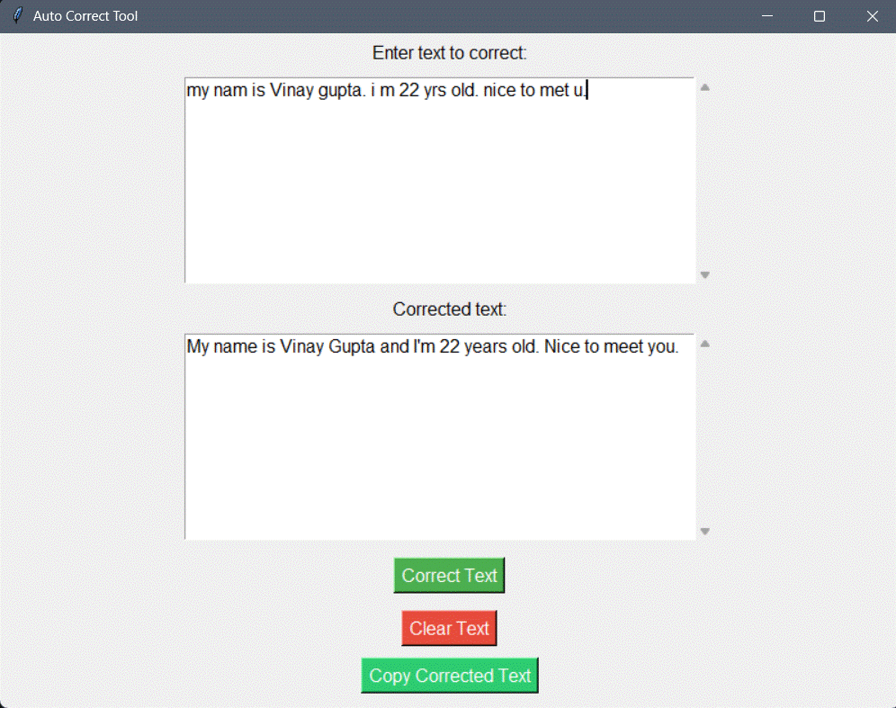

<div align="center">
  <h1>🔤 Auto Correct Tool</h1>
  <p>
    <strong>AI-Powered Grammar Correction Tool | Python | Machine Learning</strong>
  </p>
  <p>
    
  </p>
</div>

# Auto Correct Tool

A Python-based text correction tool with GUI interface that uses the T5 transformer model for grammar correction. This tool helps users correct grammar and spelling mistakes in real-time using advanced machine learning.

## Features
- Real-time text correction using T5 transformer model
- User-friendly GUI interface built with tkinter
- Copy to clipboard functionality
- Clear text option
- Proper sentence capitalization
- Error handling and user feedback
- Multi-sentence support

## Requirements
- Python 3.x
- happytransformer
- tkinter (usually comes with Python)

## Installation

1. Clone the repository:

```bash
git clone https://github.com/iamrealvinnu/autocorrect-tool.git
cd autocorrect-tool
```

2. Install required packages:

```bash
pip install happytransformer
```

## Usage

1. Run the script:
```bash
python autoCorrect_tool.py
```

2. Using the tool:
   - Enter or paste your text in the top text area
   - Click "Correct Text" to process
   - The corrected version will appear in the bottom text area
   - Use "Copy Corrected Text" to copy to clipboard
   - "Clear Text" removes all content from both areas

## How It Works

The tool uses the T5 (Text-to-Text Transfer Transformer) model specifically trained for grammar correction. It:
1. Processes input text through the model
2. Applies proper capitalization
3. Handles multiple sentences appropriately
4. Provides immediate feedback for any errors

## Contributing

Feel free to:
- Report bugs
- Suggest features
- Submit pull requests

## Author

- Vinay Gupta (https://github.com/iamrealvinnu)

## License

This project is open source and available under the MIT License.


## Technical Implementation
- Implemented using Python and T5 Transformer model
- Built GUI using Tkinter for cross-platform compatibility
- Integrated advanced NLP capabilities using happytransformer
- Implemented error handling and user feedback system
- Used object-oriented programming principles

## Future Enhancements
- Support for multiple languages
- Advanced text formatting options
- Cloud-based processing
- API integration capabilities

## Connect With Me
- LinkedIn: [https://www.linkedin.com/in/guptavinayc/]
- Portfolio: [https://gupta-vinay-portfolio.netlify.app/]
- Email: [mailto:gupta.vinayC@gmail.com]

## Development Setup
```bash
# Clone the repository
git clone https://github.com/iamrealvinnu/autocorrect-tool.git

# Navigate to project directory
cd autocorrect-tool

# Install dependencies
pip install -r requirements.txt

# Run the application
python autoCorrect_tool.py
```
